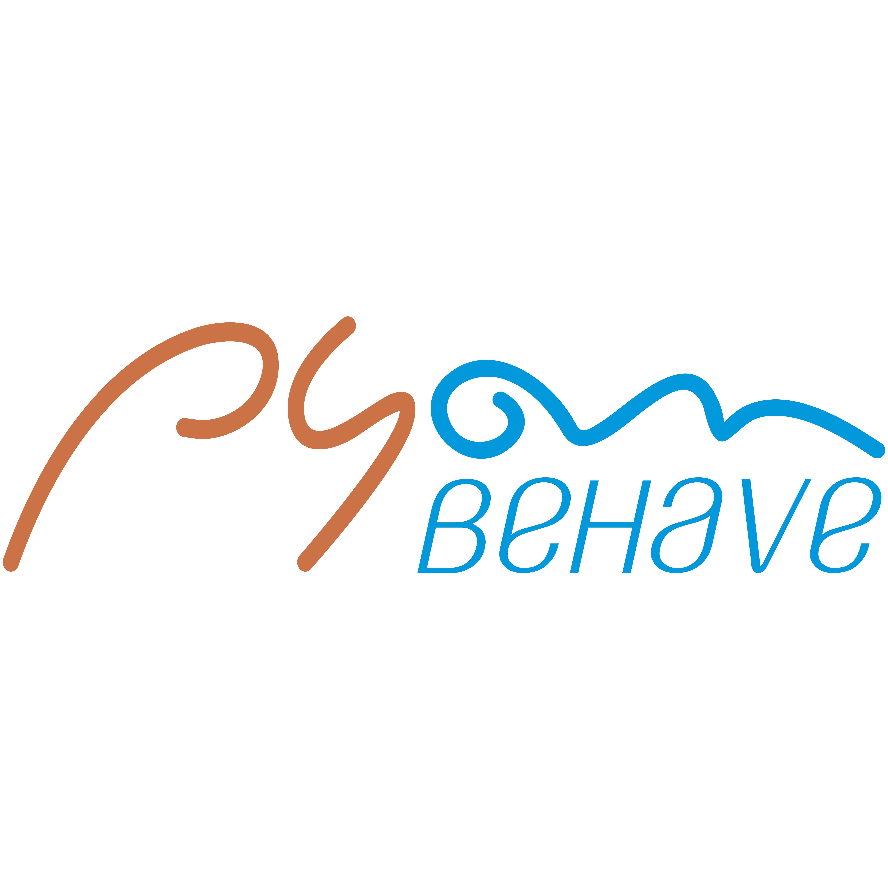

# pyon-sql-tests
PYON-SQL | SQL Testing in Python-Behave

Pyon SQL Tests project is available to implement validations for database scripts and changeset scenarios:

- Programming Language: [Python-based](https://www.python.org/downloads/).
- Framework for behavioural tests: [Behave](https://behave.readthedocs.io/en/latest/)
- Minimal library requirements: [Mysql-Connector-Python](https://pypi.org/project/mysql-connector-python/) and [cx-Oracle](https://pypi.org/project/cx-Oracle/)

To know how you can configure your environment to implement and execute this project locally or even remotely, follow all the instructions from this documentation. So, let's start with it and good luck!

## CLONING THE PROJECT FROM GITHUB

Go to [GITHUB](https://github.com/hudsonssrosa/pyon-sql-tests) and **CLONE** the project using **GIT** (download and install GIT from [here](https://git-scm.com/downloads))

In you local machine, choose you local repository and clone the project using SSH for Mac OS or Linux platforms with this command:

```bash
    git clone git@github.com:hudsonssrosa/pyon-sql-tests.git
```

If you are having issues when cloning or pushing to the repository make sure you have all your SSH keys in place. Click [here](https://help.github.com/en/github/authenticating-to-github/connecting-to-github-with-ssh) for more information about it.

## PREPARING YOUR ENVIRONMENT

### 1. Install Python

Download and install the [latest Python](https://www.python.org/downloads/) version (3.8 or over). During the installation, make sure about the root user password.

### 2. Choose a good IDE

Once you have opened the project in an IDE of your preference (suggestion: install [Visual Studio Code](https://code.visualstudio.com/download) or [PyCharm CE](https://www.jetbrains.com/pycharm/)), then you will need to *set the Python interpreter* for the project.

After this, you are able to create the *Python Virtual Environment* for the PyonUIT project and install all the requirements needed (libraries/packages). You just need to run for the first time the `update.py` and then the virtual environment as well the libraries in `requirements.txt` will be automatically installed for you.

- In Windows:

```bash
      python update.py
```

- In MacOSX or Linux:

```bash
      python3 update.py
```

### 3. Install the RDBMS to Manage your Database Locally

To test locally the examples from this project, you'll need at least the MySQL Workbench installed to manage the database created by the tests. So start installing from
[MySQL Workbench](https://dev.mysql.com/downloads/workbench/)

### 4. Ways to run this project

By default, the tests will run locally, but you have 3 ways to customise your execution.

#### 4.1 Run in debugging mode

To check if the environment is totally operational to begin with some implementation, or even check the existing tests, you might dealing with the environment variables to prepare for an execution. Thus, copy the file `env_settings.properties.local` and paste the new one in project's root (in the same place as the original file) renaming it to `env_settings.properties`. So, you can edit the properties freely, because this file is ignored by GIT versioning.

Into this file, to consider a development or debug setting, ensure the property `development_mode` is set as `true`. With this, all the properties that start with `debug_...` will be considered in a project debugging overwriting any command lines from CLI:

```properties
    [default]
    db_user =
    db_password =
    db_host =
    db_name =
    db_driver_abs_path = 

    development_mode = true
    debug_flag_environment = staging

    # Get more information about PYON CLI, type in the terminal console: "python behave_runner.py --help"
    debug_flag_target = local
    debug_flag_os = MacOS Catalina
    debug_flag_os_version =
    debug_flag_mode = mysql

    debug_behave_tags = demo-mysql
    debug_behave_excluded_tags = wip
```

- To generate Allure Reports locally, make sure you have `Java` installed and the flag `generate_report = true` on your `env_settings.properties`.

#### 4.2 Run as if it were in CI

After any implementation into the PyonUIT, it is recommended to validate the tests simulating an execution capable to inject parameters in environment variables, like it is performed in a build from a CI server. To validate a test execution, keep in mind to run in a remote server. Before this, you also will need to copy the file `run_behave.sh.local` and paste the new one in project's root (in the same place as the original file) renaming it to `run_behave.sh` to be ignored in commits.

Into this script file, you can set those environment variables, like this:

```bash
    PYON_ENVIRONMENT='staging'
    PYON_EXCLUDED_TAG='wip'
    PYON_TARGET='local'
    PYON_MODE='mysql'
    PYON_OS='MacOS Catalina'
    PYON_OS_VERSION=
    PYON_TAGS='demo-mysql'
```

#### 4.3 Run via CLI (only command line)

You can handle all those parameters presented previously (in section 4.2) setting them directly via CLI. You just need to pass the desired values in the arguments by command line.
First of all, call the main runner file in the terminal and press Enter. So, try this:

```bash
      python3 behave_runner.py --help
```

You might see all the supported arguments that you can use:

```bash
usage: behave_runner.py [options]

optional arguments:
  -h, --help            show this help message and exit
  --environment {staging,dev,production}
                        ==> Environment to execute the tests (default = staging). Find the app URLs in properties file
  --target {local}      ==> Platform to execute the tests (default = local)
  --mode {mysql,oracle}
                        ==> RDBMS to be connected (default = mysql)
  --os {MacOS High Sierra,MacOS Catalina,MacOS Big sur,Windows,Windows 10,iOS,Android,}
                        ==> Operational System from the current server
  --os_version {14.3,14.0,14,13.0,13,12.0,12,11.0,11,10.0,10,9.0,9,8.1,8.0,8,7.1,7.0,7,6.0,6,5.0,5,4.4,}
                        ==> Preferably use XX.X for mobile and XX for OS platform versions
  --tags TAGS           ==> Feature(s) / Scenario(s) to be executed (separate tags by comma and without spaces)
  --exclude {wip,skip,bug,slow,obsolete,}
                        ==> Feature(s) / Scenario(s) to be ignored / skipped from execution using a single tag (recommended: wip)
```

Finally, you can vary the command options such as these samples below and much more. If you does not pass the other arguments, it will be considered the default values:

```bash
     python behave_runner.py --target local
     python behave_runner.py --target local --environment production
     python behave_runner.py
     python behave_runner.py --os 'Windows' --os_version '10'
     python behave_runner.py --mode oracle
     python behave_runner.py --tags demo-mysql
```

## BDD APROACHING USING PYTHON-BEHAVE

The [Behaviour Driven Development](https://cucumber.io/docs/bdd/) can make our automated tests much more agile, productive, sustainable and with a living-documentation of business. Considering this, in the following sections will be presented a step-by-step about how to implement a simple scenario considering Python-Behave (library backed up by Python code - Cucumber-based) and Selenium to make possible to automate our Gherkin scenarios.

### HOW TO IMPLEMENT TESTS USING PYON-SQL?

Considering that the number of tests can increase significantly in this project, it is very important to keep in mind that you also need to have a good and coherent organisation of Query files, scenarios, steps and settings associated to the tests. Initially, to have the codes recognised by Behave framework, all the files related to test cases should be implemented into the `features` folder. Take a look at the recommended structure below.

#### 1. Gherkin Files

All the tests are documented in [Gherkin](https://behave.readthedocs.io/en/latest/tutorial.html#feature-files), a structured and natural language with properly keywords (Given, When, Then) that allows us to write testable specifications. Those files have the format `.feature` and should be organised into the '/features' with subfolders such as ENVIRONMENT FOLDER (dev/staging/production) > DOMAIN FOLDER (global name of a functionality) > FEATURE FILE. For example:

```
    features
    └─── feature_domains
        └─── staging
            │    demo_mysql_db_recriation.feature
            │    demo_mysql_table_registers.feature
            │        ...
            production
            └─── ...
```

##### 1.1. Create a Feature

With this, you could create a simple scenario that validates if user can search a product at Automation Practice Website. You just need to use the keywords with `Feature:`, `Background:`, `Scenario:`, and describe the behaviours for steps with `Given`, `When` and `Then`:

```gherkin
@demo-mysql
Feature: Selecting registers from Pyon Schema Tests tables

    Background: Cleaning up the 'pyon_schema_tests' database
        Given that "pyon_schema_tests" is connected

    @demo-mysql-tables
    Scenario: The user can create tables, populate and select registers
        Given that the tables tb_test_resource, tb_test_type, tb_category and tb_feature are created
        When user populates these tables
        Then the user can select with a join between tb_feature, tb_test_type and tb_category tables
        And the feature registers are showed
```

As you could see, add a **tag** (started with @) trying to choose an easy and intuitive name that reminds you about the Feature. Also, you can include another tag above the scenario, if you want to create new scenarios into the same file. This can make easier to call specific scenarios or an entire feature to be executed via Behave command line.

##### 1.2. Generate the Step definitions

After having a scenario defined, make sure that `development_mode` is `false` in `env_settings.properties` if you want to execute the `python3 behave_runner.py --tags demo-mysql` in the terminal (or set `development_mode` to `true` and include the tag `demo-mysql` to property `debug_behave_tags`). Then, copy the snippet definitions generated automatically in console. You will need to implement your steps using them, like these:

```bash
    You can implement step definitions for undefined steps with these snippets:

    @given(u'that "pyon_schema_tests" is connected')
    def step_impl(context):
        raise NotImplementedError(u'STEP: Given that "pyon_schema_tests" is connected')


    @given(u'that the tables tb_test_resource, tb_test_type, tb_category and tb_feature are created')
    def step_impl(context):
        raise NotImplementedError(u'STEP: Given that the tables tb_test_resource, tb_test_type, tb_category and tb_feature are created')


    @when(u'user populates these tables')
    def step_impl(context):
        raise NotImplementedError(u'STEP: When user populates these tables')


    @then(u'the user can select with a join between tb_feature, tb_test_type and tb_category tables')
    def step_impl(context):
        raise NotImplementedError(u'STEP: Then the user can select with a join between tb_feature, tb_test_type and tb_category tables')


    @then(u'the feature registers are showed')
    def step_impl(context):
        raise NotImplementedError(u'STEP: Then the feature registers are showed')
```

##### 1.3. Create a Step

Copied the snippets, create a new Python file into the '/features/steps' folder with the same or similar name of your `.feature`.
Try to increment the file name ending with `*_steps.py` and place them in the `steps` folder only (to be read by Behave framework).

```
    features
    └─── steps
        |   demo_mysql_db_schema_steps.py
        │   demo_mysql_tables_steps.py
            ...
```

Into this new Python file, you should import `behave` library to take the advantages of Behave to your [Step Implementation](https://behave.readthedocs.io/en/latest/tutorial.html#python-step-implementations).

```python
from behave import *

    # Paste your snippets for steps...
```

Then, just paste your snippets from clipboard into the `features/steps/demo_mysql_tables_steps.py` and change the `step_impl` names, for example. Then you are able to create the queries and pass all validations expected.

```python
from behave import *
from features.queries.demo_sql.demo_mysql import ScriptPyonSchema as SqlSample

@given("that the tables tb_test_resource, tb_test_type, tb_category and tb_feature are created")
def step_given_that_the_tables_test_resource_test_type_category_and_feature_are_created(context):
    SqlSample.query_create_tables(context.db_connection)


@when("user populates these tables")
def step_when_user_populates_these_tables(context):
    SqlSample.query_populate(context.db_connection)


@then("the user can select with a join between tb_feature, tb_test_type and tb_category tables")
def step_then_the_user_can_select_with_join_between_tables_feature_test_type_and_category(context):
    expected_rows = [
        ("API TEST", "Automated", "The planets from Star Wars Universe API"),
        ("MOBILE TEST", "Automated", "The user can search something on Google Search"),
        ("WEB TEST", "Automated", "The user can add a product to cart"),
        ("WEB TEST", "Manual", "The app can be created by the user after he chooses the mode"),
    ]
    SqlSample.query_select_feature_categories(context.db_connection, expected_rows)


@then("the feature registers are showed")
def step_then_the_feature_registers_are_showed(context):
    expected_rows = 4
    SqlSample.query_select_count_feature_categories(context.db_connection, expected_rows)
```

##### 1.4. Query Objects

Now, you have a basic structure using Behave, but the Steps have no SQL to cover the commands expected in the descriptions. To make this possible, all the queries need to be explicitly declared containing SQL that are recognised by a respective RDBMS settled into Pyon project. So, try to implement reusable method into `features/queries` folder, like this sample:

```
    features
    └─── queries
        └─── demo_sql
            │   demo_mysql.py
                ...
   
```

At the 'features/queries' folder, create a new page object class that inherits the BaseSQL module (`from factory.database.sql_wrapper import BaseSQL`):

```python
import time
from factory.database.sql_wrapper import BaseSQL as Db


class ScriptPyonSchema(Db):
    # ... implement the query methods here
```

Everything you need is create a methods and call the `Db.execute_sql(any_sql, json_connection, validate_content=None):`. The named arg `validate_content` is optional. On the other hand, the `any_sql` and `json_connection` are required.

```python
    @staticmethod
    def query_select_feature_categories(db_connection, expected=None):
        select_tb_feature__categories = """
            SELECT tt.type_name, tc.category_name, tf.test_description
            FROM tb_feature tf 
            JOIN tb_test_type tt 
            ON tf.id_test_type = tt.id_test_type
            JOIN tb_category tc
            ON tf.id_test_category = tc.id_test_category
            ORDER BY tt.type_name ASC;
        """
        Db.execute_sql(select_tb_feature__categories, db_connection, expected)
```

###### 1.4.a) Assertions

To create validation methods for the steps when is necessary (mainly in the `@Then` step), the Assert methods are already built into the `BaseSQL` class. So, you'll just need to send the expected values for validation distinguishing if they are a list of tuples / registers to be returned or a single number (that represents the number of rows returned):

```python
    my_list_of_registers_expected = [
            ("API TEST", "Automated", "The planets from Star Wars Universe API"),
            ("MOBILE TEST", "Automated", "The user can search something on Google Search"),
            ("WEB TEST", "Automated", "The user can add a product to cart"),
            ("WEB TEST", "Manual", "The app can be created by the user after he chooses the mode"),
        ]
```

```python
    my_total_registers_expected = 10
```

## SELECT THE SCENARIOS TO BE EXECUTED

Regardless if you are using the debug mode to execute tests or triggering them via CI server, you should set the tags accordingly declaring with or without `@`, but separating them by comma and without spaces. See these examples:

You can combine TAGS like these examples:

- e.g. 1) ISOLATED SCENARIO: `demo-mysql-cleanup`

- e.g. 2) COMBINING SCENARIOS: `demo-mysql-tables,demo-mysql-cleanup`

- e.g. 3) CALLING ENTIRE FEATURES: `demo-mysql`

If you leave the parameter related to tags empty, all the features from the environment selected will be executed regardless if is set by properties or by command line.

## Set the credentials to store and access sensitive data

As you know, some passwords and personal data cannot be exposed or accessed easily. Those datas should be encrypted and decrypted by a reliable and safer mechanism. For PYON, that mechanism is by managing the credentials through Jenkins. There are many ways to set credentials, but as the PYON consumes lots of different sensitive variables, then the strategy chosen is access a secret file uploaded and encrypted in 'Jenkins > Credentials > System > Global credentials' (you need to have permission to this page in Jenkins).

```groovy
    withCredentials([file(credentialsId: 'pyon-secret-data', variable: 'PYON_SECRET_FILE')]) {
        sh """
            rm -f $WORKSPACE/pyon_secret_data.properties
            cp $PYON_SECRET_FILE $WORKSPACE
        """
```

The variable `PYON_SECRET_FILE` is encrypted and the file is copied into the current building workspace in execution, containing the following variables:

```properties
    [app-auth]
    PYON_SECRET_APP_USER_NAME = ...
    PYON_SECRET_APP_PASS = ...

    [app-configcat]
    PYON_SECRET_CONFIGCAT_SDK_KEY_FF_DEV = ...
    PYON_SECRET_CONFIGCAT_SDK_KEY_FF_STAGING = ...
    PYON_SECRET_CONFIGCAT_SDK_KEY_FF_PRODUCTION = ...
```
